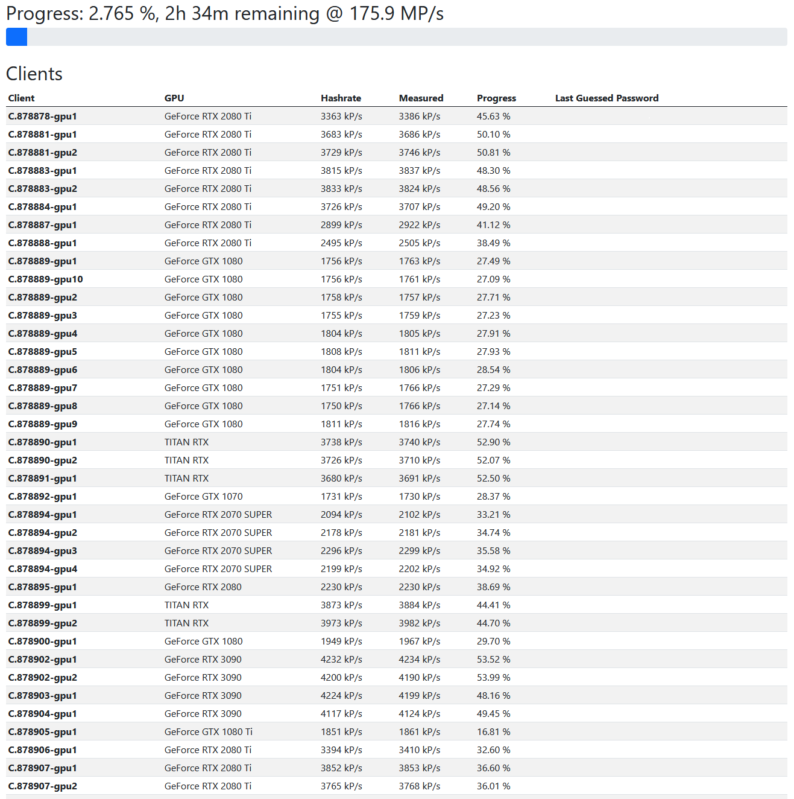
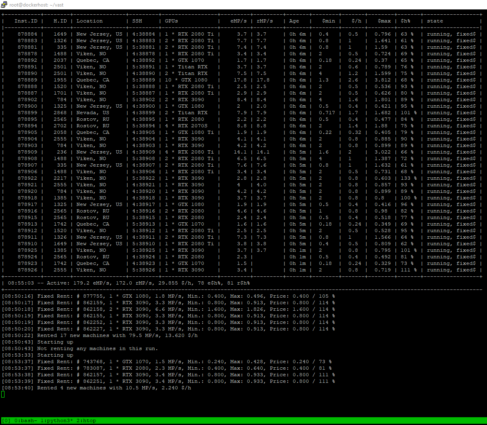

# JTRDistributed

Distributes password recovery among hundreds of GPUs. Automatically bids on the best price/performance GPUs at vast.ai, continuously adjusting for measured performance.

**Note: this was developed as a one-off - the code still needs a few days of love and refactoring to be properly usable.**

## Features
- Java Server manages workers and automatically distributes work to them 
- Web UI for monitoring workers, their performance, and the progress of the password recovery process
- Custom wordlist generator [interface](core/src/main/java/jtr/distributed/core/wordlist/WordlistGenerator.java) allows the use of password schemas not supported by John the Ripper
- Statistics module keeps track of each worker's performance
- [Python Auto-bidder](serverside/autobidder/autobidder.py): Automatically bids on the best price/performance GPUs at [vast.ai](https://vast.ai/), up to a specified price target
  - Uses live statistics generated during the password recovery process to adjust rental bids and remove under-performing workers

## Tech Stack
- Java
- Jackson
- John The Ripper
- Python